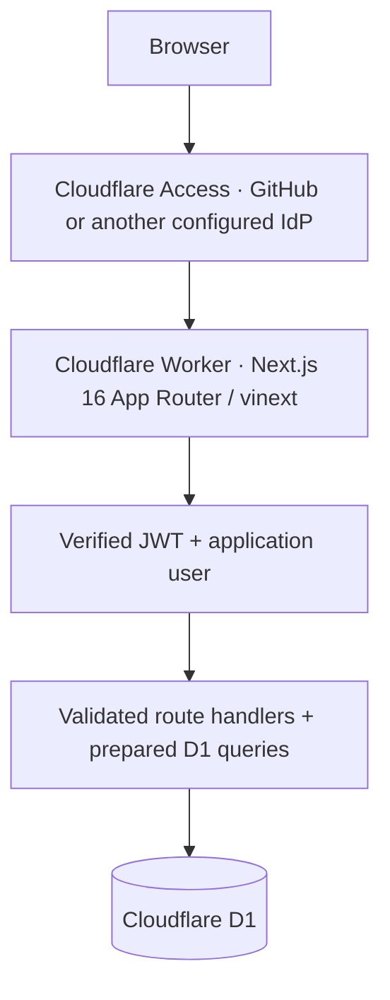

# Sales CRM

A lightweight personal CRM with the original Sales CRM interface, persistent companies, contacts, opportunities, interactions and follow-ups. Runs on Cloudflare Workers and D1, protected by Cloudflare Access.

[](https://deploy.workers.cloudflare.com/?url=https://github.com/Aditya-Baindur/sales-crm/tree/feat/cloudflare-d1-crm)

**License warning:** The upstream repository has **no LICENSE file or explicit license grant** as of October 5, 2026. Public availability does not make it licensed open-source software. This fork does not claim MIT or grant rights to upstream code or assets. Obtain permission from the original author before redistribution or use beyond the rights they have granted. Original design/code: [kargulstudio/sales-crm](https://github.com/kargulstudio/sales-crm).

## Features

- Original dark design, responsive table/sidebar, keyboard command palette (`⌘K` / `Ctrl+K`), profiles, filters, selection, CSV export, sheets and dialogs.
- Persistent company create/edit/archive/restore; website, industry, description, owner and normalized tags.
- Multiple contacts per company, including role, social links and notes.
- Contact-linked activity timeline: email, call, LinkedIn, X, meeting, note, demo, follow-up and other.
- Tasks with contact, due date, priority and completion; upcoming/overdue task notifications with persistent read state.
- Opportunity tracking: Discovery → Evaluation → Procurement; open/won/lost, value, probability and expected close date.
- Real pipeline totals, weighted forecast, activity charts and owner summaries. Relationship scorecards are explicitly derived completeness indicators, not AI assessments or invented human reviews.
- Independent personal accounts for multiple Access users; no organizations or enterprise roles.
- Optional upstream sample companies (Microsoft, Apple, Disney and others), stored in D1 after seeding. No production records are loaded from TypeScript fixtures.

## Architecture



[Cloudflare's current Next.js guide](https://developers.cloudflare.com/workers/framework-guides/web-apps/nextjs/) recommends vinext. It runs the existing Next.js App Router components on Vite/Workers. This repository uses vinext 1.x with `@cloudflare/vite-plugin`; it does not use Vercel hosting or another backend. Next.js remains installed for its API types/tooling. SVG component imports use SVGR; fonts and original assets are self-hosted.

`lib/db/repository.ts` owns prepared SQL, authorization predicates and typed results. `lib/server/validation.ts` validates inputs with Zod. Route handlers in `app/api/crm/[...path]` validate the Access user on every request. Zustand is only a server-data cache and UI state; successful mutations reload affected records.

## Local setup

Use Node.js **24 or newer**, npm, and Git. No Cloudflare credentials are needed for local D1.

```sh
git clone --branch feat/cloudflare-d1-crm https://github.com/Aditya-Baindur/sales-crm.git
cd sales-crm
npm install
cp .dev.vars.example .dev.vars
npm run db:migrate:local
npm run db:seed              # optional sample data
npm run dev
```

Open the loopback URL printed by Vite (default `http://127.0.0.1:3000`). If the port is busy, Vite prints another port. `npm run cf:dev` is the same local workerd development server. Local data lives under `.wrangler/state` and survives restart. No local command uses production D1 unless `--remote` is explicitly passed.

Local authentication requires `LOCAL_DEV_AUTH=true`, a development build and a loopback hostname. It is compiled out of production. `.dev.vars` is ignored by Git; never copy development authentication settings to deployment configuration.

```sh
npm run lint
npm run typecheck
npm test
npm run build
npx playwright install chromium
npm run test:e2e
```

The browser tests create isolated, labelled test records in local D1. They exercise company create/edit, child records, refresh persistence, command search, archive/restore and mobile navigation. Unit/integration tests execute production SQL and migrations on SQLite and verify JWT signatures/claims, CSRF, filtering, validation and account isolation.

## D1 migrations

`migrations/0001_crm.sql` creates the schema, foreign keys, query indexes, same-company contact constraints and atomic opportunity rollup triggers. Wrangler tracks applied versions in `d1_migrations`.

```sh
npm run db:migrate:local    # local database
npm run db:migrate         # production database, requires Cloudflare login/token
npm run cf:types           # regenerate Worker bindings after config changes
```

Optional seeds are idempotent and insert only missing sample records; they do not overwrite existing records. Demo owners are clearly labelled and scoped to the seeded account. Upstream fabricated emails are replaced with `.invalid` addresses. `SEED_EMAIL` identifies the personal account that will own the examples:

```sh
npm run db:seed
SEED_EMAIL=you@example.com npm run db:seed:remote
```

For production, use the email returned by your Access identity provider. Different emails get different personal accounts. To use an empty CRM, skip seeding. No sample data is created at app startup.

## Cloudflare Access setup

Configure Access **before** publishing an application hostname. Production denies requests if Access configuration or a valid JWT is missing, even when reached through an unexpected route.

1. Enable Cloudflare One / Zero Trust for your account and configure an identity provider (GitHub, Google, an organization IdP, or email one-time PIN).
2. Create a **Self-hosted** Access application protecting the entire production hostname, including `/api/*`, with no path restriction or bypass policy. Workers supports Access on `workers.dev`; a custom domain is optional.
3. Create an Allow policy containing only your exact email(s) initially. Use an email-domain rule only if every user of that domain should be admitted. Do not use an Everyone rule for a personal CRM.
4. Set `ACCESS_TEAM_DOMAIN` to `https://YOUR-TEAM.cloudflareaccess.com` and `ACCESS_AUD` to this application's audience tag in `wrangler.jsonc`.
5. Keep Preview URLs disabled, or protect all Worker traffic with [Worker-level Access](https://developers.cloudflare.com/workers/configuration/cloudflare-access/). Protect any new custom domain before attaching it.
6. Sign in through Access. The app creates/loads a user by verified normalized email. Name/avatar fall back gracefully when not supplied. Sign out from My Profile.

The server verifies RS256 signatures using the team's JWKS, and checks issuer, audience, expiry, issued-at, user subject, email and application token type. It never trusts `Cf-Access-Authenticated-User-Email` or a browser-supplied user ID. The JWT audience is configuration, not a secret. The application itself needs **no API tokens or client secrets**.

Use an owner-only Access policy initially. Each verified email maps to its own independent personal account. See the [deployment checklist](docs/DEPLOYMENT.md) for setup and verification steps.

## Deployment

Create resources in your own Cloudflare account before the first deployment. The checked-in configuration contains placeholders, not a live account or database.

```sh
npx wrangler login
npx wrangler d1 create sales-crm
```

Replace the placeholder `database_id` in `wrangler.jsonc` with the returned database ID. Configure an owner-only Access application for your intended hostname and set `ACCESS_TEAM_DOMAIN` / `ACCESS_AUD` in that file. Set `NEXT_PUBLIC_SITE_URL` to your HTTPS application origin when building production metadata. If your login has multiple Cloudflare accounts, set `CLOUDFLARE_ACCOUNT_ID` to the intended account ID.

```sh
npm run cf:types
npm run deploy
```

`deploy` builds the Worker, applies remote migrations, then deploys the generated Vite Worker configuration. `npm run start` runs the built production Worker locally; it still requires a valid Access JWT, so use `npm run dev` for ordinary local work. No personal domain, database ID, identity allowlist or account ID is supplied by this repository.

## Deploy to Cloudflare button

The official button above points to this contribution branch. [Cloudflare's supported flow](https://developers.cloudflare.com/workers/platform/deploy-buttons/) copies the repository, provisions a Worker and D1 from the Wrangler bindings, rewrites resource IDs, and can connect Workers Builds.

Use **build command** `npm run build` and **deploy command** `npm run deploy:build` so migrations are applied before the Worker is published. Confirm that the generated `DB` binding points to your newly provisioned database.

Access applications/policies are **not automatically created by this button**. Create the Access application and replace `ACCESS_TEAM_DOMAIN` / `ACCESS_AUD` before first use, then redeploy. Until these match a valid Access session, the app rejects access. Do not enable public previews. The local-only example variables may appear as suggested secrets in the button UI: omit them; production never uses them.

## Environment variables

| Name                    | Where                    | Purpose                                                     |
| ----------------------- | ------------------------ | ----------------------------------------------------------- |
| `NEXT_PUBLIC_SITE_URL`  | Build environment        | Canonical application origin; defaults to local development |
| `DB`                    | D1 binding               | The CRM database; never exposed to the browser              |
| `ACCESS_TEAM_DOMAIN`    | Wrangler `vars`          | HTTPS Cloudflare Access team origin                         |
| `ACCESS_AUD`            | Wrangler `vars`          | This Access application's audience                          |
| `LOCAL_DEV_AUTH`        | `.dev.vars` only         | Opt into local development identity                         |
| `LOCAL_DEV_EMAIL`       | `.dev.vars` only         | Default `developer@localhost.test`                          |
| `SEED_EMAIL`            | Seed command environment | Account email for optional production examples              |
| `CLOUDFLARE_ACCOUNT_ID` | CLI / CI variable        | Account to deploy to                                        |
| `CLOUDFLARE_API_TOKEN`  | GitHub secret / CI only  | Deployment credential; never needed by the running CRM      |

## GitHub Actions

`.github/workflows/ci.yml` runs on pull requests and pushes to `main`: `npm ci`, lint, TypeScript, tests, production build and local D1 browser tests. PRs receive no deployment credentials.

Automatic deployment is opt-in after verification. Set repository variable `CLOUDFLARE_DEPLOY_ENABLED=true`, variable `CLOUDFLARE_ACCOUNT_ID`, and secret `CLOUDFLARE_API_TOKEN`. Use a least-privilege account-scoped token for Workers deployment and D1 migration, and restrict the GitHub `production` environment to `main`. The [current official GitHub Actions guide](https://developers.cloudflare.com/workers/ci-cd/external-cicd/github-actions/) uses an API token; this project does not invent an unsupported OIDC exchange.

Alternatively use Cloudflare Workers Builds with its native GitHub integration and managed build credential, using the commands above. Choose one automatic deployment system to avoid concurrent deployments. This repository does not publish previews containing personal data.

## Database schema

| Table                | Purpose                                                                              |
| -------------------- | ------------------------------------------------------------------------------------ |
| `users`              | Access identities and explicitly marked account-scoped demo owners (`managed_by`)    |
| `companies`          | Account ownership, owner assignment, metadata, aggregate pipeline, archive timestamp |
| `contacts`           | Company people, email/phone/social links, role and plain-text notes                  |
| `opportunities`      | Company deals, stage, value, probability, expected close date, status                |
| `interactions`       | Company/contact timeline with author and occurrence timestamp                        |
| `tasks`              | Company/contact follow-ups, assignee, due/completed timestamps and priority          |
| `tags`               | Per-account unique tag names                                                         |
| `company_tags`       | Normalized company/tag many-to-many relationship                                     |
| `notification_reads` | Per-user task notification acknowledgement                                           |

Every company has an `account_id` referring to an authenticated user. Child operations check that account through their company; record IDs and owner fields cannot change account ownership. Archiving preserves related history. Pipeline values are computed from open opportunities (weighted average probability); edit an opportunity to change them.

## Security and operational notes

- Prepared SQL and fixed identifier allowlists; Zod bounds and strict schemas; same-origin JSON mutations; no CORS access.
- Access enforced both at Cloudflare and inside the app. Private/no-store responses; no personal data in static builds.
- Text content is rendered as text. Website/social URLs allow only HTTP(S) without credentials. Uploaded logos accept small raster data URLs (128 KB), not arbitrary SVG/HTML.
- Seed fixtures are never imported into production pages. CSV exports retain formula escaping.
- Follow-up notifications cover due tasks in the next seven days. Activity summaries cover the last 90 days, with 7/30/90-day detail windows; company sparklines cover 14 days. No email is sent automatically.
- API company lists and record lists are paginated (maximum 100/page). The personal CRM client loads company summaries into a cache for instant command search and filters. Child timelines load in pages of 100. Very large datasets would benefit from server-driven table pagination/search.
- D1 Time Travel is available for database recovery. Export/back up before destructive administrative SQL; Worker rollback does not roll back migrations.
- See [security review](docs/SECURITY.md) for dependency advisories, threat checks and remaining verification limits.

## Upstream repository attribution

Design, original UI components, icons, assets and initial demo content originate from **[kargulstudio/sales-crm](https://github.com/kargulstudio/sales-crm)**. The `upstream` Git remote preserves that relationship. This fork adds Cloudflare runtime integration, Access authentication, D1 persistence, real CRM records, tests, CI and deployment documentation.

**No upstream license was found.** No MIT/open-source license is asserted for this fork's inherited work. Dependency licenses apply to their respective packages. See [upstream audit](docs/UPSTREAM-AUDIT.md).
